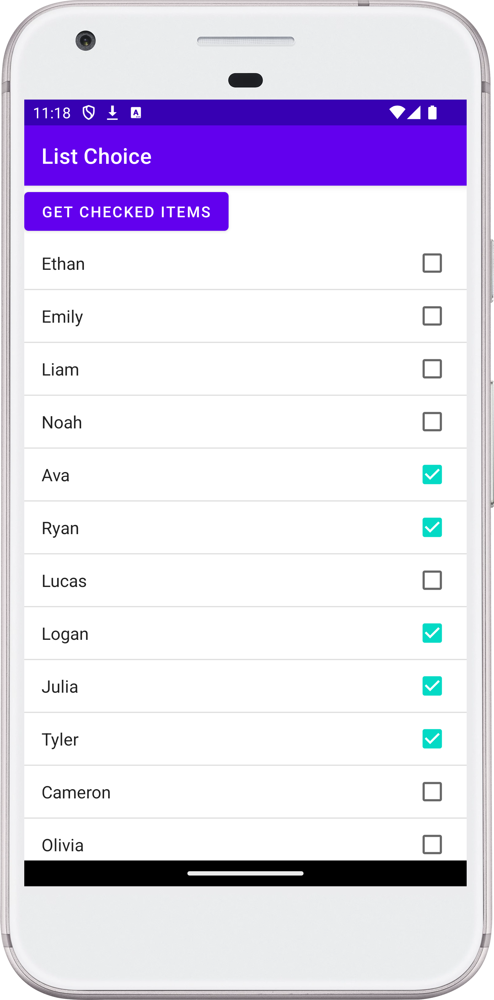

[](https://stand-with-ukraine.pp.ua)


# SimpleListChoice

## Description

SimpleListChoice is an educational project that provides an example of how to
implement a list view for single and multiple selections using checkboxes in
an Android application. Developers can explore the code to understand the
implementation and potentially use similar functionality in their own projects.

## Installation

1. Clone the repository
2. Open the project in Android Studio
3. Run the project on an emulator or a physical Android device

## Purpose

The main purpose of this project is to demonstrate how to implement list views
with single and multiple selections using checkboxes. It is intended for
educational purposes and as a reference for developers looking to implement
similar functionality in their projects.

## Technologies

- [Android](https://developer.android.com/studio/intro)
- [Kotlin](https://kotlinlang.org/)
- [Monolithic Architecture](https://en.wikipedia.org/wiki/Monolithic_application)

## Usage

1. Run the application on an Android device
2. Click on checkboxes to select items
3. Retrieve data from selected items using the provided code example

## Code Example

```kotlin
class MainActivity : AppCompatActivity(), View.OnClickListener {

  companion object {
    const val LOG_TAG = "myLogs"
  }

  private lateinit var lvMain: ListView
  private lateinit var names: Array<String>

  /** Called when the activity is first created.  */
  override fun onCreate(savedInstanceState: Bundle?) {
    super.onCreate(savedInstanceState)
    setContentView(R.layout.activity_main)
    lvMain = findViewById<View>(R.id.lv_main) as ListView
    /** Setting the mode for selecting list items. */

    /** For multiple choice. */
    lvMain.choiceMode = ListView.CHOICE_MODE_MULTIPLE

    val adapter = ArrayAdapter.createFromResource(
      this, R.array.names,
      android.R.layout.simple_list_item_multiple_choice
    )

    lvMain.adapter = adapter
    val btnChecked: Button = findViewById<View>(R.id.btn_checked) as Button
    btnChecked.setOnClickListener(this)

    /** getting array from a resource file */
    names = resources.getStringArray(R.array.names)
  }

  override fun onClick(arg0: View?) {
    /** Writing the selected items to the log. */

    /** For multiple choice. */
    Log.d(LOG_TAG, "checked: ")
    val sbArray: SparseBooleanArray = lvMain.checkedItemPositions
    val checkedItems: MutableList<String> = mutableListOf()
    for (i in 0 until sbArray.size()) {
      val key = sbArray.keyAt(i)
      if (sbArray[key]) {
        Log.d(LOG_TAG, names[key])
        checkedItems.add(names[key])
      }
    }
    Toast.makeText(this, "checked: $checkedItems", Toast.LENGTH_SHORT)
      .show()
  }
}
```

## Contributing

- You can create an issue or pull request with changes to the master branch
- Contributions are welcome but not necessary, given the educational nature of
  the project

## License

This project does not have an intentional license specified.

## Screenshot:

<!--suppress CheckImageSize -->

